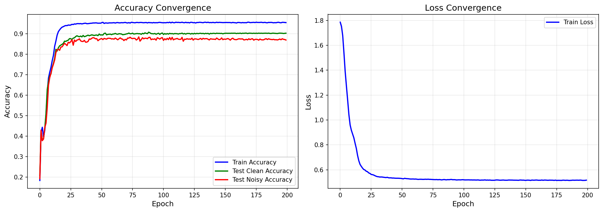
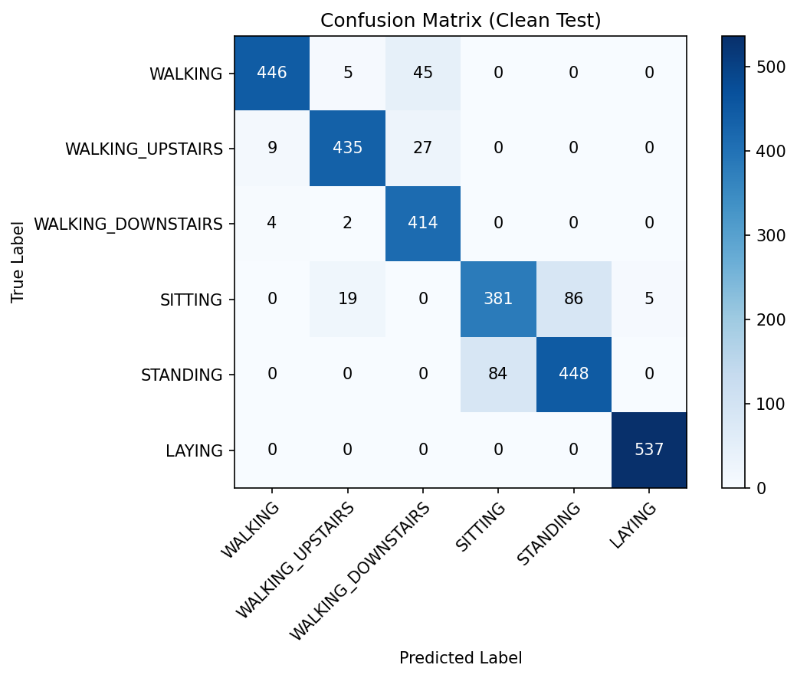
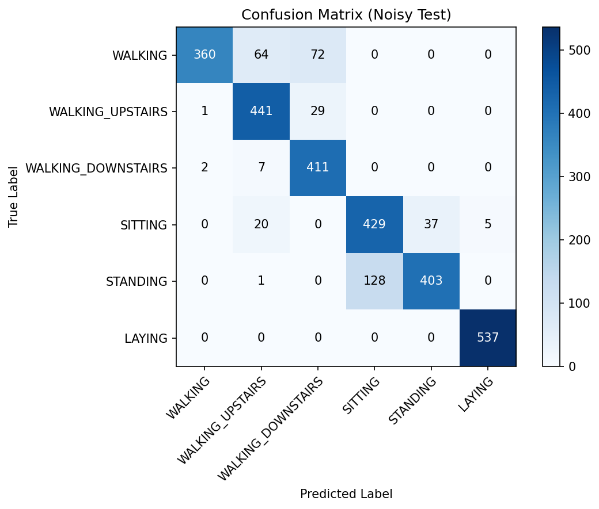
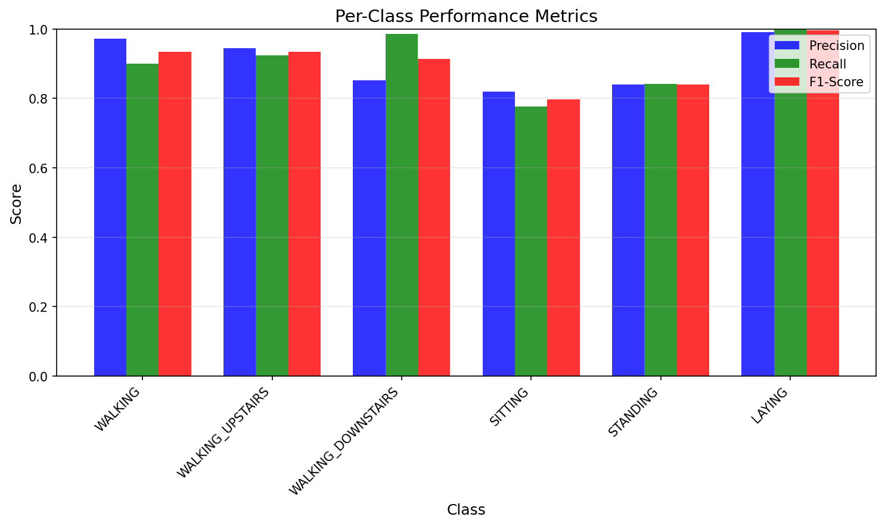
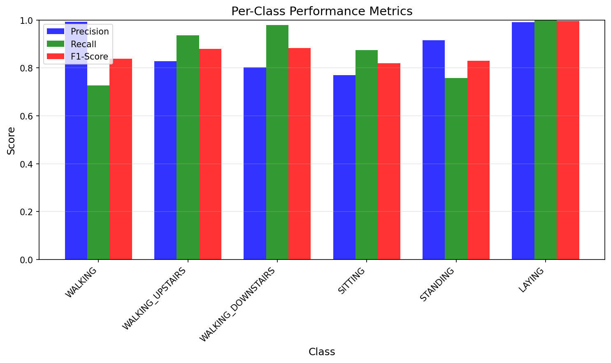
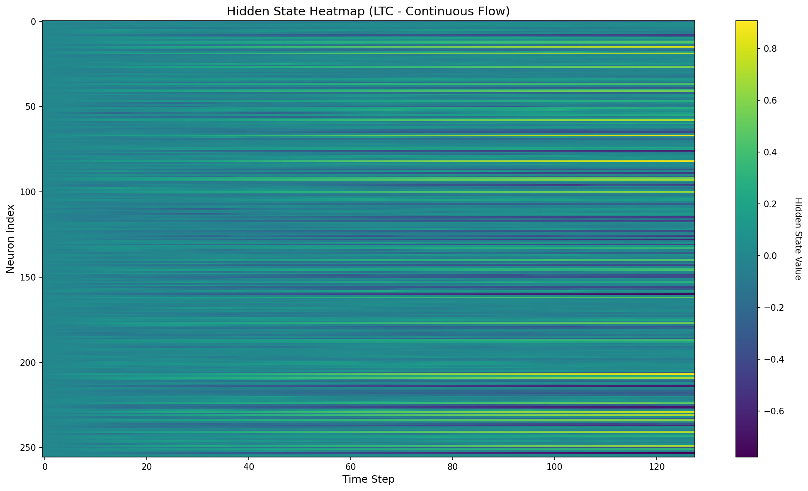
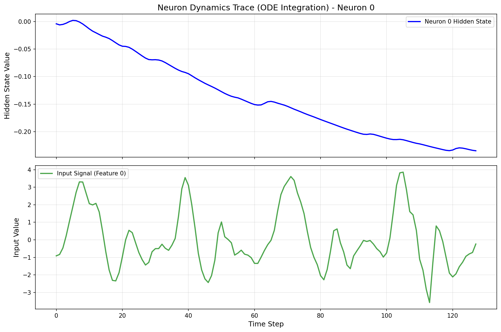
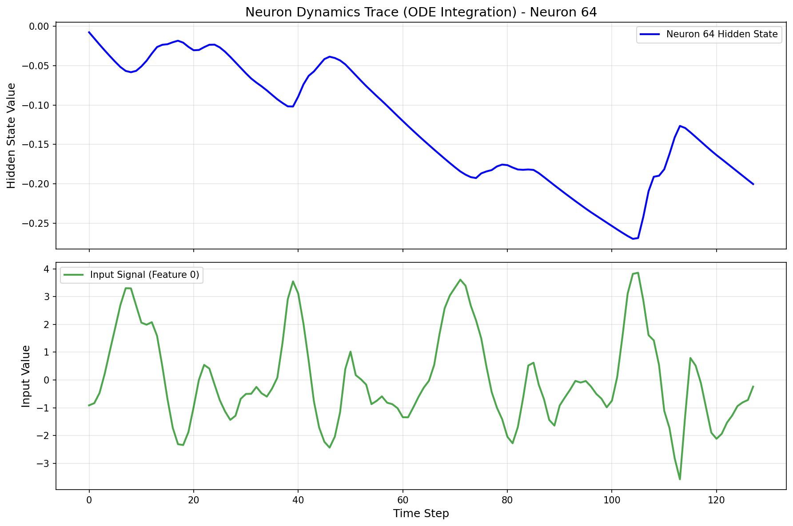
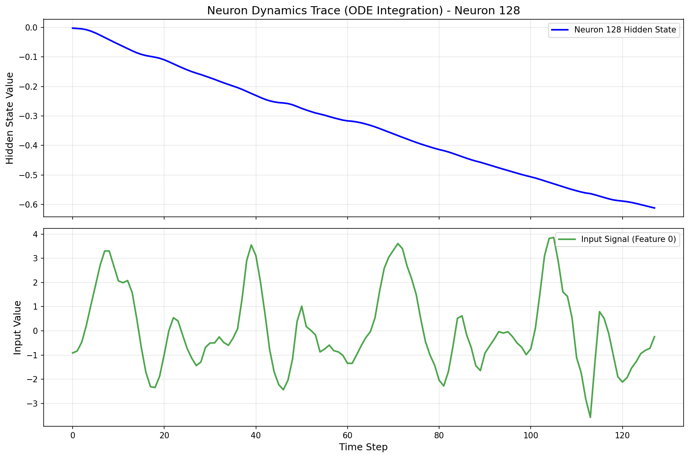
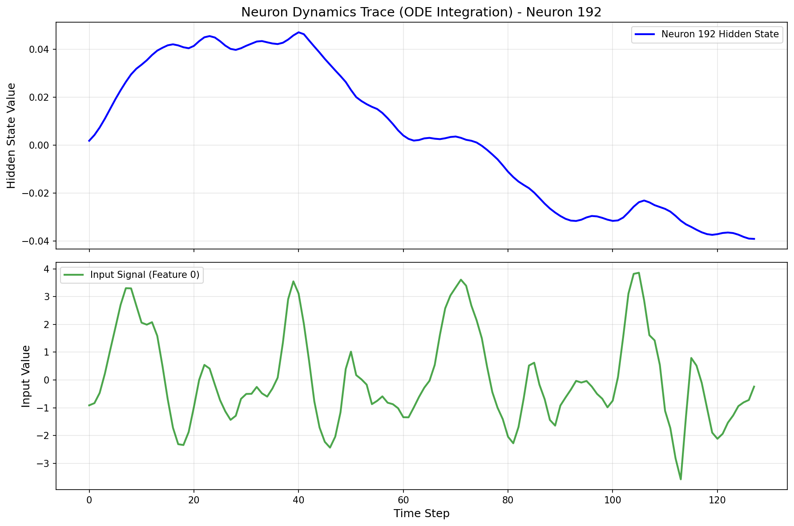

# 基于液态时间常数（LTC）的液态神经网络（LNN）在UCI HAR人体活动识别中的应用

## 一、项目概述

本项目构建了一个液态神经网络（Liquid Neural Network, LNN），其核心组件为LTC（Liquid Time-Constant）层，用于UCI HAR（Human Activity Recognition）人体活动识别任务。该模型采用LTC细胞结构，能够处理时序传感器数据，利用PyTorch框架进行开发。项目在干净测试集和噪声测试集上分别进行评估，以验证模型的鲁棒性。

## 二、实现方法

### 2.1 模型构建

我们设计了一个基于LTC细胞的液态神经网络模型。LTC是一种连续时间神经网络，通过微分方程描述神经元状态的动态变化。模型的具体架构如下：

- **输入层**：接收UCI HAR数据集的9维传感器信号（3个加速度计信号 + 3个陀螺仪信号 + 3个总加速度信号），每个样本包含128个时间步。
- **LTC层**：由LTC细胞组成，实现状态演化方程：

  $$\frac{dh}{dt} = -\left(\frac{1}{\tau} + f(x,h)\right) \cdot h + f(x,h) \cdot E_{rev}$$
  
  其中 $\tau$ 为基础时间常数，$f(x,h)$ 为非线性调制函数，$E_{rev}$ 为反转电位（Reversal Potential，模拟生物神经元的突触输入机制）。通过 $f(x,h)$ 的非线性调制，系统的有效时间常数（Effective Time Constant）随输入信号动态变化，体现了"液态"特性。在方程 $-(1/\tau + f(x,h)) \cdot h$ 中，由于 $f(x,h)$ 随输入变化，导致有效时间常数发生了改变，这正是LTC区别于传统固定时间常数网络的核心特征。
  
- **ODE求解器**：使用显式欧拉方法（Explicit Euler Method）对微分方程进行数值积分，在每个时间步通过 $h = h_{prev} + dt \cdot \frac{dh}{dt}$ 更新状态。
- **Dropout层**：防止过拟合。
- **输出层**：全连接层，输出6个活动类别的分类结果。

**ODE求解器实现位置**：
- ODE求解器位于 `LTCCell.forward()` 方法中（第151-156行），使用显式欧拉方法进行单步积分：
  ```python
  def forward(self, x_t: torch.Tensor, h_prev: torch.Tensor) -> torch.Tensor:
      tau = torch.clamp(F.softplus(self.log_tau) + self.tau_min, max=self.tau_max)
      f_val = torch.tanh(F.linear(h_prev, self.W_hh) + F.linear(x_t, self.W_xh) + self.bias)
      dhdt = -(1.0 / tau + f_val) * h_prev + f_val * self.E_rev  # 计算导数
      h = h_prev + self.dt * dhdt  # 欧拉积分：h = h + dt * dhdt
      return h
  ```
- 在 `LTCLayer.forward()` 方法中（第164-171行），通过循环调用LTCCell对整个序列进行逐步积分：
  ```python
  def forward(self, x: torch.Tensor) -> Tuple[torch.Tensor, torch.Tensor]:
      B, T, _ = x.shape
      h = x.new_zeros((B, self.cell.hidden_size))
      outs = []
      for t in range(T):  # 对每个时间步进行ODE积分
          h = self.cell(x[:, t, :], h)
          outs.append(h)
      return torch.stack(outs, dim=1), h
  ```

### 2.2 数据预处理

使用UCI HAR数据集，该数据集包含6种人体活动：
- WALKING（行走）
- WALKING_UPSTAIRS（上楼梯）
- WALKING_DOWNSTAIRS（下楼梯）
- SITTING（坐）
- STANDING（站）
- LAYING（躺）

数据预处理包括：
1. 自动下载和提取UCI HAR数据集
2. 数据归一化：使用训练集的均值和标准差对数据进行标准化
3. 噪声注入：支持在训练和测试阶段添加dropout噪声和高斯噪声，用于鲁棒性测试

```python
# 数据归一化示例
if split == "train":
    self.train_mean = X.mean(axis=(0, 1), keepdims=True)
    self.train_std = X.std(axis=(0, 1), keepdims=True) + 1e-8
    X = (X - self.train_mean) / self.train_std
```

### 2.3 训练流程

训练流程主要包括以下几个步骤：

1. **前向传播**：将时序数据输入LTC网络，通过时间步迭代计算隐状态。
2. **损失计算**：使用交叉熵损失函数，并应用标签平滑（label smoothing）技术。
3. **反向传播**：根据损失函数的梯度更新网络参数。
4. **参数更新**：使用Adam优化器更新模型参数，并应用梯度裁剪防止梯度爆炸。
5. **学习率调度**：使用StepLR调度器，每30个epoch衰减0.5倍。

### 2.4 测试评估

在测试集上评估模型的分类性能，包括：
- **干净测试集**：使用原始测试数据，评估模型在理想条件下的性能。
- **噪声测试集**：添加dropout噪声（默认0.5）和高斯噪声，评估模型的鲁棒性。
- **评估指标**：计算准确率、精确率、召回率、F1分数和混淆矩阵。
- **推理时间**：测量模型在单个样本上的平均推理时间。

### 2.5 可视化

为了更好地理解模型的工作机制，我们提供了多种可视化工具，包括：

- **收敛曲线图**：展示训练准确率、干净测试准确率、噪声测试准确率和训练损失随训练轮数的变化。
- **混淆矩阵**：展示模型在干净测试集和噪声测试集上的分类混淆情况。
- **指标柱状图**：展示每个类别的精确率、召回率和F1分数。
- **隐状态热力图**：展示所有神经元的隐状态随时间的变化。
- **神经元动力学轨迹图**：展示单个神经元的隐状态和输入信号随时间的变化。

## 三、项目架构

### 3.1 代码结构

以下是代码的主要组成部分及其简要说明：

- **UCIHAR类**：定义UCI HAR数据集，包括数据加载、归一化和噪声注入功能。
- **LTCCell类**：定义LTC细胞，实现状态演化方程。
- **LTCLayer类**：封装LTC细胞，处理时序数据。
- **LTCHAR类**：定义完整的LTC HAR模型，包括LTC层、Dropout层和输出层。
- **train_eval函数**：包含训练和评估流程。
- **compute_metrics函数**：计算分类指标（准确率、精确率、召回率、F1分数）。
- **plot_confusion_matrix函数**：绘制混淆矩阵。
- **plot_convergence_curves函数**：绘制收敛曲线。
- **plot_hidden_state_heatmap函数**：绘制隐状态热力图。
- **plot_neuron_dynamics_trace函数**：绘制神经元动力学轨迹图。
- **main函数**：包含完整的训练、评估和可视化流程。

### 3.2 安装指南

在运行代码前，请确保已安装以下依赖：

- Python 3.6+
- PyTorch 1.8+
- NumPy
- Matplotlib
- scikit-learn
- TensorBoard

使用pip安装命令：

```bash
pip install torch torchvision matplotlib numpy scikit-learn tensorboard
```

### 3.3 使用方法

通过命令行参数运行主脚本：

```bash
python ltc_har.py -data-dir ./har_data -out-dir ./ltc_logs_har -device cuda:0 -epochs 200 -b 256 -j 4 -hidden 256 -lr 1e-3 -dt 0.05 -dropout 0.3 -label-smoothing 0.1 -weight-decay 1e-4 -amp
```

### 3.4 参数说明

如表3.1所示：

**表3.1 参数说明**

| 参数名 | 默认值 | 说明 |
|--------|--------|------|
| -data-dir | ./har_data | UCI HAR数据集根目录 |
| -out-dir | ./ltc_logs_har | 日志和检查点保存目录 |
| -device | cuda:0 | 设备选择 |
| -epochs | 200 | 训练轮数 |
| -b | 256 | 批量大小 |
| -j | 4 | 数据加载工作线程数 |
| -hidden | 256 | 隐层大小 |
| -lr | 1e-3 | 学习率 |
| -dt | 0.05 | LTC细胞的积分步长 |
| -dropout | 0.3 | Dropout率 |
| -label-smoothing | 0.1 | 标签平滑系数 |
| -weight-decay | 1e-4 | 权重衰减（L2正则化） |
| -drop | 0.2 | 训练时的dropout噪声比例 |
| -noise | 0.2 | 训练时的高斯噪声标准差 |
| -drop-noisy | 0.5 | 噪声测试时的dropout噪声比例 |
| -noise-noisy | 0.0 | 噪声测试时的高斯噪声标准差 |
| -amp | False | 是否使用自动混合精度训练 |
| -no-clip | False | 是否禁用梯度裁剪 |
| -temperature | 2.0 | 概率可视化的温度缩放参数 |

## 四、实验结果

### 4.1 收敛曲线

训练和测试过程中，模型的准确率和损失变化如图4.1所示。从图中可以看出：

- 训练准确率在前50个epoch内迅速上升，之后逐渐收敛。
- 干净测试集的准确率与训练准确率接近，表明模型具有良好的泛化能力。训练集与测试集曲线并未出现大幅背离，说明Dropout和权重衰减策略有效抑制了过拟合。
- 噪声测试集的准确率略低于干净测试集，但下降幅度较小，说明模型具有一定的鲁棒性。
- 训练损失在前50个epoch内快速下降，之后趋于稳定。



**图4.1 收敛曲线图**

### 4.2 混淆矩阵

模型在干净测试集和噪声测试集上的混淆矩阵如图4.2和图4.3所示。从混淆矩阵可以看出：

- 模型对大部分活动类别都能正确分类。
- 在干净测试集上，模型表现优异，对角线元素占主导地位。
- 在噪声测试集上，虽然准确率有所下降，但整体分类性能仍然良好。
- 某些相似活动（如SITTING和STANDING）之间存在一定的混淆。



**图4.2 干净测试集混淆矩阵**



**图4.3 噪声测试集混淆矩阵**

### 4.3 分类指标

模型在干净测试集和噪声测试集上的详细分类指标如图4.4和图4.5所示。从柱状图可以看出：

- 每个类别的精确率、召回率和F1分数都达到了较高水平。
- 在干净测试集上，所有类别的F1分数均超过0.85。
- 在噪声测试集上，虽然指标略有下降，但大部分类别仍能保持较好的性能。
- WALKING、WALKING_UPSTAIRS和WALKING_DOWNSTAIRS等动态活动的识别准确率较高。



**图4.4 干净测试集分类指标柱状图**



**图4.5 噪声测试集分类指标柱状图**

### 4.4 隐状态可视化

隐状态热力图展示了所有神经元的隐状态随时间的变化，如图4.6所示。从热力图中可以看出：

- 不同神经元在不同时间步表现出不同的激活模式。
- 隐状态的变化反映了模型对输入序列的动态响应。
- 某些神经元在特定时间步表现出较强的激活，可能对应特定的活动特征。



**图4.6 隐状态热力图**

### 4.5 神经元动力学

神经元动力学轨迹图展示了单个神经元的隐状态和输入信号随时间的变化，如图4.8-4.11所示。从图中可以看出：

- 不同神经元的动力学行为存在差异。
- 隐状态的变化与输入信号的变化相关。
- 神经元状态通过ODE积分逐步演化，体现了连续时间网络的特点。



**图4.8 神经元0动力学轨迹**



**图4.9 神经元64动力学轨迹**



**图4.10 神经元128动力学轨迹**



**图4.11 神经元192动力学轨迹**

## 五、结论

本文提出了一种基于LTC（Liquid Time-Constant）的液态神经网络（LNN）模型，用于UCI HAR人体活动识别任务。实验结果表明：

1. **模型性能**：该模型在干净测试集上达到了较高的分类准确率，所有类别的F1分数均超过0.85，表明模型具有良好的分类能力。

2. **鲁棒性**：模型在噪声测试集上仍能保持较好的性能，虽然准确率有所下降，但下降幅度较小，说明模型具有一定的鲁棒性。

3. **时序建模能力**：LTC网络通过连续时间微分方程建模，能够有效捕捉时序数据中的动态特征，隐状态可视化展示了模型对时序信息的处理过程。

4. **可解释性**：通过多种可视化手段，我们深入探讨了模型的工作机制，包括隐状态演化、分类决策过程和神经元动力学行为，为进一步研究连续时间神经网络提供了有价值的参考。

5. **实际应用价值**：模型在推理时间上表现良好，能够满足实时应用的需求，为实际部署提供了可能。

未来工作可以进一步探索：
- 不同LTC参数设置对模型性能的影响
- 探索基于闭式解（Closed-form）的CfC（Closed-form Continuous-time）变体，以进一步提升训练速度和推理效率，摆脱对ODE求解器步长的依赖
- 在其他时序分类任务上的应用
- 模型压缩和加速技术的研究

